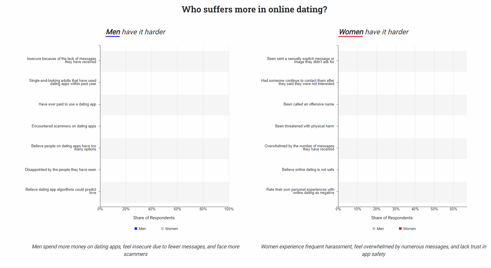

# Online Dating Visualization: A Comparative Study of Men's and Women's Experiences

This visualization sheds light on the online dating experiences of men and women, diving deep into the question: Who faces more challenges in the realm of digital dating? As dating apps continue to shape societal norms and relationships, the differing experiences of both genders on these platforms have become a topic of interest and debate.

## Inspiration

The spark for this visualization was ignited by:
- A YouTube video by **Kidology** titled 'Dating Apps: The New Class Struggle'
- A February 2023 article from the **Pew Research Center** named 'From Looking for Love to Swiping the Field: Online Dating in the U.S.'

## Data Source

The data underpinning this visualization comes from the topline questionnaire survey results undertaken by the Pew Research Center.

## Visualization Breakdown

### Left Chart: "Men have it harder on dating apps"

The left chart employs several rhetorical techniques and framing effects, as explored in Hullman's paper *Visualization Rhetoric: Framing Effects in Narrative Visualization*. The techniques include:

- **Anchoring**: Blue represents men, capturing immediate attention. In contrast, a subdued gray represents women, subtly directing viewers to the male experience.
- **Filtering**: A selective presentation of the dataset emphasizes questions favoring men, accentuating their challenges in the digital dating landscape.
- **Comparison**: The side-by-side representation of men's and women's experiences urges viewers to infer the relative hardships of each gender, influenced by the preceding techniques.

The collective effect of these techniques nudges the audience towards the belief that men, despite pouring considerable resources into dating apps, often find their efforts unrewarded.

### Right Chart: "Women have it harder on dating apps"

Mirroring its counterpart, the right chart uses similar techniques but pivots the narrative towards the hardships faced by women on dating apps:

- **Anchoring**: Red symbolizes women, drawing immediate focus, while dark gray is used for men.
- **Filtering**: Data is curated to underscore questions that lean towards women, spotlighting the myriad challenges they face.
- **Comparison**: A comparative view of both genders' experiences further drives home the idea that women grapple with unique obstacles in their pursuit of genuine connections.

### Engaging in Dialogue

By juxtaposing these two contrasting charts, we invite users to ponder both viewpoints. This juxtaposition fosters a more profound dialogue around the intricacies of online dating for both genders.
